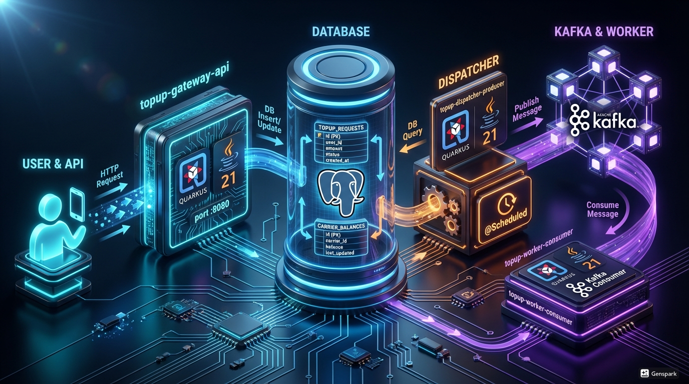

# 📱 Smart Top-Up System (Quarkus Reactive Event-Driven)
Este proyecto consiste en una arquitectura de microservicios distribuida diseñada con **Quarkus 3** y **Java 21**. El sistema procesa recargas telefónicas de forma asíncrona utilizando **Kafka** para el desacoplamiento y un flujo basado en eventos (Event-Driven).

---

## 🏗️ Arquitectura del Sistema
El sistema se divide en tres componentes independientes que se ejecutan sobre Docker, comunicándose mediante una base de datos compartida y un bus de mensajes Kafka.





---

## 🛠️ Componentes del Proyecto

### 1. `sync-topup-api-v1` (API Gateway)
* **Responsabilidad:** Punto de entrada para los usuarios. Valida el formato del JSON e inserta la solicitud inicial en la base de datos.
* **URL:** `POST http://localhost:8080/v1/topups`
* **Input (JSON):**
    ```json
    {
      "phoneNumber": "987654321",
      "amount": 50.0,
      "carrier": "MOVISTAR"
    }
    ```
* **Output:** `202 Accepted` (Indica que la petición fue recibida y está en proceso de validación).

### 2. `async-topup-producer-v1` (Event Dispatcher)
* **Responsabilidad:** Escanea la base de datos en busca de nuevas solicitudes y las publica en Kafka para su procesamiento asíncrono.
* **Mecanismo:** Utiliza `@Scheduled` de Quarkus para revisar la tabla cada 1 segundo (Polling).
* **Output:** Evento serializado en **Avro** enviado al tópico `topup-events`.

### 3. `topup-processor-worker` (Transaction Processor)
* **Responsabilidad:** Ejecuta la lógica de negocio pesada. Escucha Kafka, valida saldos disponibles y finaliza la transacción.
* **Input:** Mensaje Avro desde el tópico de Kafka.
* **Acción:** Actualiza el estado final de la transacción y descuenta el saldo del operador.


---

## 🗄️ Modelo de Datos (PostgreSQL)

El sistema utiliza las siguientes tablas para gestionar el estado de las operaciones:

### Tabla 1: `TOPUP_REQUESTS`
| Field | Tipo | Descripción |
| :--- | :--- | :--- |
| `id` | UUID (PK) | Identificador único de la transacción. |
| `phone_number` | VARCHAR(15) | Número de destino de la recarga. |
| `amount` | DECIMAL | Valor monetario de la transacción. |
| `carrier` | VARCHAR(20) | Nombre de la operadora (CLARO, MOVISTAR, ENTEL). |
| `status` | VARCHAR(20) | Flujo: `PENDING`, `SENT_TO_KAFKA`, `SUCCESSFUL`, `FAILED`. |

### Tabla 2: `CARRIER_BALANCES`
| Field | Tipo | Descripción |
| :--- | :--- | :--- |
| `carrier` | VARCHAR (PK) | ID o nombre del operador telefónico. |
| `current_balance` | DECIMAL | Saldo total disponible para distribuir. |

---

## 🧬 Contrato de Mensajería (Avro Schema)
Para garantizar la integridad y el tipado fuerte en Kafka, se utiliza el siguiente esquema:

```json
{
  "type": "record",
  "name": "TopUpEvent",
  "namespace": "com.rodrigo.topup.avro",
  "fields": [
    { "name": "requestId", "type": "string" },
    { "name": "phoneNumber", "type": "string" },
    { "name": "amount", "type": "double" },
    { "name": "carrier", "type": "string" }
  ]
}
```
--

## 1. Los 3 Componentes (Arquitectura Quarkus)

### Componente 1: Gateway API (Quarkus REST)
Es el punto de entrada. Su única misión es recibir la petición y asegurar que el dato entró al sistema.
- Interacción: Recibe un JSON { telefono, monto }.
- Base de Datos: Inserta en la tabla recargas_solicitudes con estado PENDIENTE.
- Reactividad: Devuelve un Uni Response con un código 202 Accepted.

### Componente 2: Event Producer (Quarkus Asíncrono)
Actúa como un puente inteligente para desacoplar la API de la mensajería.
- Interacción: Se activa cuando la API termina de guardar.
- Función: Toma los datos de la base de datos, los transforma al esquema de Kafka y los envía al tópico topic-validacion-recarga.
- Sustento: Si Kafka presenta latencia, la API no se bloquea.

### Componente 3: Processor & Validator (Quarkus Consumer)
Es el cerebro del sistema. Vive escuchando a Kafka y no tiene endpoints REST.
- Interacción: Lee el mensaje del tópico.
- Lógica: Consulta la tabla saldos_disponibles para validar fondos.
- Base de Datos: Descuenta el saldo y actualiza la tabla recargas_solicitudes a estado COMPLETADO.

## 2. Diagrama de Interacción Técnica

El flujo de información entre los servicios sigue este orden:


1. Cliente -> Gateway API (HTTP POST)
2. Gateway API -> Base de Datos (Persistencia inicial)
3. Event Producer -> Kafka Topic (Publicación del evento)
4. Processor & Validator -> Kafka Topic (Consumo del evento)
5. Processor & Validator -> Base de Datos (Validación y actualización final)

## 3. Modelo de Datos

Para este proyecto de estudio, se utilizan las siguientes tablas:

- recargas_solicitudes: id, telefono, monto, estado (PENDIENTE, PROCESANDO, EXITOSA, FALLIDA).
- bolsa_saldo: operador_id, nombre_operador, saldo_actual.
- auditoria_procesos: id, recarga_id, fecha_finalizacion, detalle_error.

## 4. Ventajas del Diseño

- Es Real: Sigue el patrón de los sistemas de pagos reales donde la validación externa puede tardar.
- Full Stack Tecnológico: Implementa Quarkus, Kafka, programación reactiva con Mutiny (Uni/Multi) y persistencia asíncrona.


---
---

# PASOS de BD ;

## los INSERT organizados por el momento en que cada microservicio actuaría.

------------------------------------------------------------------------

## Paso 1: Configuración Inicial (Bolsa de Dinero)

Antes de empezar, necesitamos saldo en el sistema. Esto lo haría un
administrador.

``` sql
-- Ponemos dinero para los operadores en Perú
INSERT INTO balance_wallets (operator_name, current_balance, currency) VALUES ('Movistar', 100.00, 'PEN');
INSERT INTO balance_wallets (operator_name, current_balance, currency) VALUES ('Claro', 50.00, 'PEN');
```

------------------------------------------------------------------------

## Paso 2: Acción del Gateway API (Componente 1)

Cuando el usuario presiona "Recargar" en su app, tu primer servicio de
Quarkus ejecuta esto.\
Nota que el estado es PENDING.

``` sql
-- Simulamos una recarga de 20 soles
INSERT INTO recharge_requests (recharge_id, phone_number, amount, status) 
VALUES ('req-777-abc', '987654321', 20.00, 'PENDING');
```

------------------------------------------------------------------------

## Paso 3: Acción del Processor & Validator (Componente 3)

Después de que el mensaje viaja por Kafka, el tercer componente procesa
la lógica.

### Escenario A: Todo salió bien (Éxito)

El consumidor valida que hay saldo, descuenta los 20 soles de la bolsa y
actualiza la auditoría.

``` sql
-- 1. Descontamos el saldo (El Consumer lo hace)
UPDATE balance_wallets 
SET current_balance = current_balance - 20.00 
WHERE operator_name = 'Movistar';

-- 2. Marcamos como exitosa la solicitud
UPDATE recharge_requests 
SET status = 'SUCCESSFUL' 
WHERE recharge_id = 'req-777-abc';

-- 3. Llenamos la auditoría con el detalle del éxito
INSERT INTO process_audits (recharge_id, error_details) 
VALUES ('req-777-abc', 'Transaction processed by Kafka Consumer. Balance deducted from Movistar.');
```

------------------------------------------------------------------------

### Escenario B: No hay dinero suficiente (Fallo)

Imagina que alguien pide una recarga de 500 soles, pero solo tenemos
100.

``` sql
-- 1. Registramos la solicitud pendiente (C1)
INSERT INTO recharge_requests (recharge_id, phone_number, amount, status) 
VALUES ('req-999-xyz', '912345678', 500.00, 'PENDING');

-- 2. El Consumer (C3) detecta el error y actualiza a FAILED
UPDATE recharge_requests 
SET status = 'FAILED' 
WHERE recharge_id = 'req-999-xyz';

-- 3. Llenamos la auditoría explicando POR QUÉ falló
INSERT INTO process_audits (recharge_id, error_details) 
VALUES ('req-999-xyz', 'Insufficient balance. Required: 500.00, Available: 80.00 (Movistar)');
```

------------------------------------------------------------------------

## ¿Cómo verificar que todo se llenó bien?

Ejecuta este JOIN para ver la "película completa" de tus transacciones:

``` sql
SELECT 
    r.recharge_id, 
    r.phone_number, 
    r.amount, 
    r.status, 
    a.completion_date, 
    a.error_details
FROM recharge_requests r
LEFT JOIN process_audits a 
    ON r.recharge_id = a.recharge_id;
```
